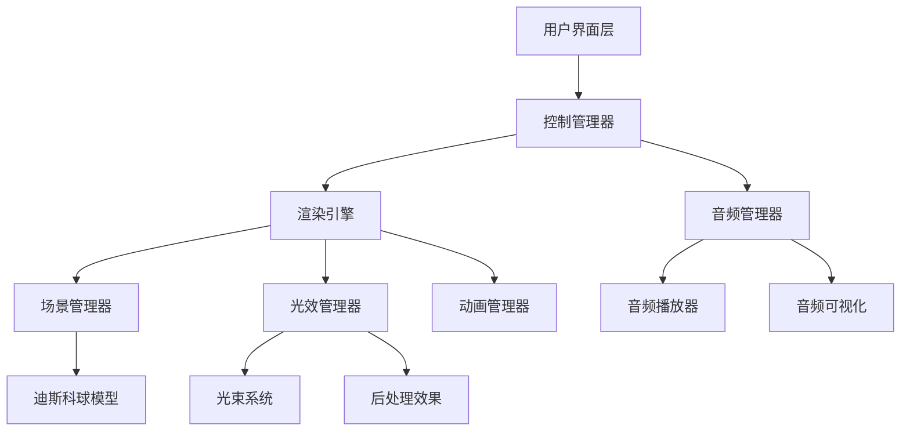

# 设计文档

## 概述

七彩炫光迪斯科灯球交互页面是一个基于WebGL的3D交互应用，使用Three.js框架实现高质量的视觉效果。系统采用模块化架构，分离渲染、音频、控制和用户界面等功能模块，确保代码的可维护性和可扩展性。

## 架构

### 系统架构图



### 技术栈

- **前端框架**: 原生JavaScript (ES6+)
- **3D渲染**: Three.js
- **音频处理**: Web Audio API
- **构建工具**: Vite
- **样式**: CSS3 + CSS变量
- **响应式**: CSS Grid + Flexbox

## 组件和接口

### 1. 渲染引擎 (RenderEngine)

负责整个3D场景的渲染和管理。

```javascript
class RenderEngine {
  constructor(container) {
    this.scene = new THREE.Scene();
    this.camera = new THREE.PerspectiveCamera();
    this.renderer = new THREE.WebGLRenderer();
    this.composer = new EffectComposer(); // 后处理
  }
  
  init() { /* 初始化渲染器设置 */ }
  render() { /* 渲染循环 */ }
  resize() { /* 响应式调整 */ }
  dispose() { /* 资源清理 */ }
}
```

### 2. 迪斯科球模型 (DiscoBall)

核心的3D灯球对象，包含几何体、材质和灯孔。

```javascript
class DiscoBall {
  constructor() {
    this.geometry = new THREE.SphereGeometry();
    this.material = new THREE.MeshPhysicalMaterial({
      color: 0xffffff,
      metalness: 0.9,
      roughness: 0.1,
      envMapIntensity: 1.0
    });
    this.holes = []; // 灯孔位置数组
  }
  
  createHoles() { /* 生成20个均匀分布的灯孔 */ }
  updateRotation(speed, direction) { /* 更新旋转 */ }
  updateMaterial() { /* 更新材质属性 */ }
}
```

### 3. 光束系统 (LightBeamSystem)

管理从灯孔发射的彩色光束和眩光效果。

```javascript
class LightBeamSystem {
  constructor(discoBall) {
    this.beams = [];
    this.colorMode = 'rainbow'; // 'rainbow' | 'random'
    this.lensFlares = [];
  }
  
  createBeams() { /* 为每个灯孔创建光束 */ }
  updateColors() { /* 更新光束颜色 */ }
  updateRotation() { /* 同步旋转 */ }
  setColorMode(mode) { /* 切换颜色模式 */ }
}
```

### 4. 音频管理器 (AudioManager)

处理背景音乐播放和音频可视化。

```javascript
class AudioManager {
  constructor() {
    this.audioContext = new AudioContext();
    this.audioElement = new Audio();
    this.analyser = this.audioContext.createAnalyser();
    this.isPlaying = false;
  }
  
  loadTrack(url) { /* 加载音频文件 */ }
  play() { /* 播放音乐 */ }
  pause() { /* 暂停音乐 */ }
  getFrequencyData() { /* 获取音频频谱数据 */ }
}
```

### 5. 控制管理器 (ControlManager)

管理用户交互和系统状态。

```javascript
class ControlManager {
  constructor() {
    this.rotationSpeed = 1; // 0.5, 1, 2 (慢/中/快)
    this.rotationDirection = 1; // 1: 顺时针, -1: 逆时针
    this.colorMode = 'rainbow';
    this.musicPlaying = false;
    this.syncRotationWithMusic = true;
  }
  
  setRotationSpeed(speed) { /* 设置旋转速度 */ }
  setRotationDirection(direction) { /* 设置旋转方向 */ }
  setColorMode(mode) { /* 设置颜色模式 */ }
  toggleMusic() { /* 切换音乐播放状态 */ }
}
```

### 6. 用户界面 (UIController)

管理控制面板和用户交互界面。

```javascript
class UIController {
  constructor(controlManager) {
    this.controlManager = controlManager;
    this.elements = {
      playButton: null,
      speedSlider: null,
      directionToggle: null,
      colorModeToggle: null
    };
  }
  
  init() { /* 初始化UI元素 */ }
  bindEvents() { /* 绑定事件监听器 */ }
  updateUI() { /* 更新UI状态 */ }
}
```

## 数据模型

### 配置对象

```javascript
const CONFIG = {
  ball: {
    radius: 2,
    segments: 32,
    holes: 20,
    metalness: 0.9,
    roughness: 0.1
  },
  lighting: {
    ambientIntensity: 0.2,
    directionalIntensity: 1.0,
    beamIntensity: 2.0
  },
  animation: {
    rotationSpeeds: [0.5, 1.0, 2.0], // 慢/中/快
    colorTransitionSpeed: 0.02
  },
  responsive: {
    desktop: { ballScale: 0.4 },
    tablet: { ballScale: 0.5 },
    mobile: { ballScale: 0.6 }
  }
};
```

### 状态管理

```javascript
const AppState = {
  rendering: {
    isInitialized: false,
    frameRate: 60,
    quality: 'high' // 'low' | 'medium' | 'high'
  },
  disco: {
    rotation: { speed: 1, direction: 1 },
    lighting: { mode: 'rainbow', intensity: 1 }
  },
  audio: {
    isPlaying: false,
    volume: 0.7,
    currentTrack: null
  },
  ui: {
    controlsVisible: true,
    isMobile: false
  }
};
```

## 错误处理

### WebGL支持检测

```javascript
function checkWebGLSupport() {
  try {
    const canvas = document.createElement('canvas');
    const gl = canvas.getContext('webgl') || canvas.getContext('experimental-webgl');
    return !!gl;
  } catch (e) {
    return false;
  }
}
```

### 音频支持检测

```javascript
function checkAudioSupport() {
  return !!(window.AudioContext || window.webkitAudioContext);
}
```

### 错误处理策略

1. **WebGL不支持**: 显示降级提示，提供静态图片替代
2. **音频加载失败**: 显示错误信息，允许用户重试
3. **性能不足**: 自动降低渲染质量
4. **移动端限制**: 调整效果复杂度

## 测试策略

### 单元测试

- 各个类的核心方法测试
- 数学计算函数测试（旋转、颜色变换）
- 配置验证测试

### 集成测试

- 渲染引擎与场景管理器集成
- 音频管理器与控制管理器集成
- UI控制器与系统状态同步

### 性能测试

- 帧率监控（目标60fps）
- 内存使用监控
- 不同设备性能基准测试

### 兼容性测试

- 主流浏览器测试（Chrome, Firefox, Safari, Edge）
- 移动端浏览器测试
- 不同屏幕尺寸适配测试

### 用户体验测试

- 控制响应性测试
- 音视频同步测试
- 加载时间测试

## 实现细节

### 光束效果实现

使用圆锥几何体配合自定义着色器实现光束：

```glsl
// 顶点着色器
varying vec3 vPosition;
void main() {
  vPosition = position;
  gl_Position = projectionMatrix * modelViewMatrix * vec4(position, 1.0);
}

// 片段着色器
uniform vec3 color;
uniform float opacity;
varying vec3 vPosition;
void main() {
  float alpha = opacity * (1.0 - length(vPosition.xy));
  gl_FragColor = vec4(color, alpha);
}
```

### 眩光效果

使用Three.js的LensFlare或自定义Sprite实现：

```javascript
const lensFlare = new THREE.Sprite(lensFlareMaterial);
lensFlare.scale.set(100, 100, 1);
lensFlare.position.copy(beamOrigin);
```

### 响应式设计

```css
.disco-container {
  width: 100vw;
  height: 100vh;
  position: relative;
}

.controls-panel {
  position: absolute;
  bottom: 20px;
  left: 50%;
  transform: translateX(-50%);
  display: flex;
  gap: 15px;
  padding: 15px;
  background: rgba(0, 0, 0, 0.7);
  border-radius: 10px;
  backdrop-filter: blur(10px);
}

@media (max-width: 768px) {
  .controls-panel {
    flex-direction: column;
    bottom: 10px;
    padding: 10px;
  }
}
```

### 性能优化

1. **LOD系统**: 根据设备性能调整模型复杂度
2. **对象池**: 重用光束和粒子对象
3. **帧率控制**: 动态调整渲染质量
4. **懒加载**: 按需加载音频资源